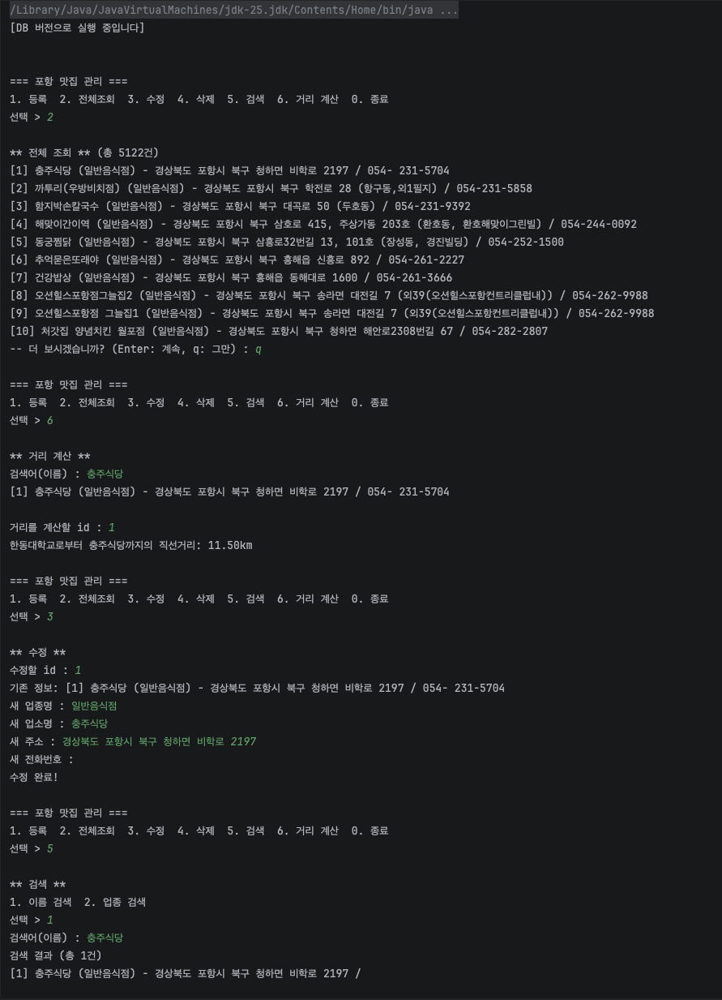

# 26-3_Java-Project1

# 포항(한동대 근처) 맛집 관리 CRUD 프로그램

## 1. 프로젝트 주제 및 소개

Java 기반 CRUD 프로그램을 파일 저장 버전과 DB(MariaDB) 저장 버전 두 가지로 구현하는 학습 프로젝트입니다.
주제는 **포항시(특히 한동대학교 인근, 흥해읍 일대) 음식점 관리**로 정했습니다.

단순히 기능을 동작시키는 데 그치지 않고, Spring Boot/Spring Legacy Project를 배우기 전에 그 구조의 기반이 되는 **계층형 아키텍처**와 **인터페이스 기반 Repository 패턴**을 직접 손으로 구현해보는 것이 이 프로젝트의 핵심 목표입니다.

데이터는 공공데이터포털의 "경상북도 포항시 포항음식점 정보"(포항푸드 맞춤형DB, 2025-08-14 기준)를 활용했으며, 도로명주소에 "포항시 북구"가 포함된 데이터만 필터링해 사용했습니다.

## 2. 주요 기능 설명

| 기능 | 설명 |
|---|---|
| 등록 | 업종명/업소명/주소/전화번호 입력받아 등록 (이름 빈 값, 잘못된 업종명, 중복 등록 검증) |
| 전체조회 | 전체 목록 조회, 10건씩 페이지네이션 |
| 수정 | id로 기존 정보 확인 후 수정 (등록과 동일한 검증 적용) |
| 삭제 | id로 삭제 대상 확인 → y/n 확인 절차 후 삭제 |
| 검색 | 이름(부분 일치) / 업종(완전 일치) 검색, 결과 개수 표시 |
| 거리 계산 | 이름으로 맛집 검색 → id 선택 → VWorld 지오코더 API로 주소를 좌표 변환 → 하버사인 공식으로 한동대학교로부터의 직선거리 계산 |

## 3. 사용 기술 및 버전

- Java 17
- Maven
- MariaDB 11.4 (Docker)
- JDBC (mariadb-java-client 3.4.1)
- Docker, Docker Compose
- org.json (JSON 파싱)
- VWorld 지오코더 API (국토교통부 공간정보 오픈플랫폼)
- Git / GitHub (Git Flow)

## 4. 프로젝트 폴더 구조
src/main/java/com/example/restaurant/
├── Main.java
├── model/
│   └── Restaurant.java
├── repository/
│   ├── RestaurantRepository.java        ← interface
│   ├── RestaurantMemoryRepository.java  ← 메모리 기반 구현체
│   ├── RestaurantFileRepository.java    ← 파일 기반 구현체
│   └── RestaurantDBRepository.java      ← DB(JDBC) 기반 구현체
├── service/
│   └── RestaurantService.java
├── util/
│   ├── DBConnection.java                ← Singleton 패턴
│   └── VWorldGeocoder.java              ← 주소→좌표 변환, 거리 계산
├── seed/
│   └── CsvSeeder.java                   ← 공공데이터 CSV 시딩용 유틸
└── view/
└── ConsoleView.java
src/main/resources/
├── db.properties           ← DB 접속 정보 (gitignore)
├── db.properties.example
├── vworld.properties       ← VWorld API 키 (gitignore)
├── vworld.properties.example
├── pohang_restaurants.csv  ← 공공데이터 원본
└── restaurants.txt         ← 파일 버전 CRUD 저장소
docker-compose.yml
schema.sql
pom.xml

## 5. 실행 방법

1. `db.properties.example` → `db.properties`로 복사 후 값 채우기 (DB 버전 사용 시)
2. `vworld.properties.example` → `vworld.properties`로 복사 후 VWorld API 키 입력 (거리 계산 기능 사용 시)
3. `Main.java`에서 원하는 버전의 주석을 해제해 Repository 구현체 선택:
```java
   // 메모리 버전
   RestaurantRepository repository = new RestaurantMemoryRepository();

   // 파일 버전
   RestaurantRepository repository = new RestaurantFileRepository();

   // DB 버전
   RestaurantRepository repository = new RestaurantDBRepository();
```
4. (파일/DB 버전 초기 데이터가 필요하면) `CsvSeeder.java`의 `main()`을 실행해 `pohang_restaurants.csv`로부터 데이터를 시딩
5. `Main.java` 실행

## 6. Docker 실행 방법

```bash
docker compose up -d
```

`docker-compose.yml`은 재현성을 위해 이미지 태그를 `latest`가 아닌 `mariadb:11.4`로 고정했습니다. 컨테이너는 호스트의 `3307` 포트로 노출되며(로컬에 이미 3306 포트를 쓰는 다른 MySQL/MariaDB가 있어 충돌 방지), `db.properties`도 이에 맞춰 `localhost:3307`로 접속하도록 설정합니다.

DB 스키마는 `schema.sql`을 직접 실행해 생성합니다 (IntelliJ Database 도구 또는 CLI).

## 7. DB 테이블 구조

```sql
CREATE TABLE restaurants (
    id BIGINT AUTO_INCREMENT PRIMARY KEY,
    category VARCHAR(20) NOT NULL,
    restaurant_name VARCHAR(100) NOT NULL,
    address VARCHAR(255),
    phone_number VARCHAR(20)
);
```

## 8. 주요 기능 실행 예시



## 9. Git Branch 전략

Git Flow를 따랐습니다.
main    ← 최종 제출 브랜치 (동작하는 코드만, Step 7에서 develop과 1회 병합)
develop ← 개발 통합 브랜치
feature/model-design   ← 모델/인터페이스/메모리 구현체
feature/file-crud      ← 파일 저장 버전
feature/db-crud        ← DB 연동 버전
feature/search-count   ← 검색 결과 개수 표시
feature/pagination     ← 전체조회 페이지네이션
feature/distance-calc  ← 거리 계산 기능 (VWorld API 연동)

각 feature 브랜치는 기능 단위로 커밋을 나누고(`feat`/`fix`/`refactor`/`chore`/`docs` 타입 구분), 작업이 끝나면 `develop`으로 병합했습니다.

## 10. 인터페이스 기반 설계를 선택한 이유

`Repository`를 인터페이스로 정의하고 `Memory`/`File`/`DB` 세 가지 구현체를 만든 이유는, **저장 방식(어떻게 저장하는지)과 비즈니스 로직(무엇을 할지)을 분리**하기 위해서입니다.

`Service`는 `RestaurantRepository` 인터페이스 타입에만 의존하고 구체 클래스를 직접 참조하지 않기 때문에, `Main.java`에서 구현체를 한 줄만 바꾸면 `Service`/`View` 코드를 전혀 건드리지 않고 파일 버전 ↔ DB 버전 전환이 가능합니다. 이는 Spring의 `@Repository` + 의존성 주입(DI)이 자동으로 처리해주는 것을 직접 손으로 구현해본 것이며, 실제로 검증 로직(빈 이름, 잘못된 업종명, 중복 등록)을 `Service` 한 곳에만 작성해도 세 가지 버전 모두에 동일하게 적용된다는 점에서 이 설계의 실효성을 확인할 수 있었습니다.

## 11. 개발 중 어려웠던 점과 해결 방법

- **Sources Root 중복 지정으로 인한 패키지 인식 오류**: `com/example/restaurant` 폴더가 실수로 추가 Sources Root로 잡혀 있어 패키지 경로가 어긋난 문제를 `.iml` 설정 확인으로 해결.
- **CSV 콤마 이스케이프 문제**: 공공데이터 CSV의 도로명주소 필드에 콤마가 다수 포함되어(`"항구동,외1필지"`), 단순 콤마 split이 아닌 정규식 기반 CSV 파서로 대응.
- **Scanner 버퍼 꼬임**: `nextInt()`/`nextLong()`과 `nextLine()`을 섞어 쓰면 개행문자가 남아 다음 입력이 씹히는 문제 → 모든 입력을 `nextLine()` + 형변환으로 통일.
- **DB Connection 조기 close 버그**: `RestaurantDBRepository`에서 Singleton으로 관리해야 할 `Connection`을 실수로 `try-with-resources` 안에 포함시켜, 호출할 때마다 공유 커넥션이 닫혀버리는 문제 발생. `Connection`을 try 블록 밖으로 분리하고 `PreparedStatement`/`ResultSet`만 try-with-resources로 관리하도록 수정.
- **HttpClient 무한 대기**: 외부 API 호출 시 타임아웃을 설정하지 않아 네트워크 문제 시 응답 없이 멈추는 현상 발생 → `connectTimeout`, `timeout` 설정 추가.
- **카카오맵 API → VWorld API 전환**: 처음에는 카카오맵 API로 거리 계산 기능을 구현하려 했으나, 개인 개발자가 카카오맵 API를 사용하려면 "비즈 앱 전환"이 필요하고, 이는 본인인증 + 카카오 데브톡 커뮤니티 수동 신청 및 승인 대기가 필요해 촉박한 일정에 맞추기 어려웠습니다. 대안을 조사한 끝에 국토교통부의 공간정보 오픈플랫폼인 **VWorld 지오코더 API**로 전환했습니다. 사업자/비즈 인증 절차 없이 즉시 키가 발급되어 일정 내 기능을 완성할 수 있었고, 이 과정에서 "동일한 목적을 달성하는 여러 API 중 실제 서비스 정책과 제약을 비교해 선택하는 판단력"을 기를 수 있었습니다.

## 12. 데이터 지속가능성에 대한 설계 고민

현재 구조는 공공데이터 CSV를 한 번 시딩(seed)해서 DB/파일에 반영하는 **일회성 스냅샷 임포트** 방식입니다. 만약 이 프로젝트가 실제 서비스로 확장되어 공공데이터가 주기적으로 갱신되고, 동시에 사용자가 앱에서 직접 데이터를 등록/수정하는 상황이 된다면, **재동기화 시 공공데이터와 사용자 수정본 사이의 충돌** 문제가 발생합니다.

이를 해결하기 위한 설계 방향을 다음과 같이 정리했습니다 (현재는 미구현, 향후 개발 계획 참고):

1. **출처 구분(source tagging)**: 레코드마다 `data_source`(PUBLIC/USER_EDITED) 같은 필드를 두어, 공공데이터 재동기화 시 사용자가 수정하지 않은 레코드만 갱신 대상으로 삼습니다.
2. **매칭 키 문제**: 현재 PK인 `id`는 `AUTO_INCREMENT`라 재시딩 시 안정적인 매칭 기준이 될 수 없습니다. "상호명 + 주소" 같은 자연키(natural key)를 매칭 기준으로 삼아 "동일한 실제 식당인지"를 판단해야 합니다.
3. **충돌 정책**: 사용자가 수정한 레코드는 공공데이터 재동기화 시 자동으로 덮어쓰지 않는 것을 기본 정책으로 삼는 것이 안전하다고 판단했습니다(사용자 우선 정책). 자동 판단이 어려운 경우 충돌 목록을 별도로 쌓아 수동 검토하는 방식도 고려할 수 있습니다.

## 13. 향후 개발 계획 (TODO)

이번 제출에는 반영하지 못했지만, 추후 개선하고자 하는 항목들입니다.

- [ ] `is_user_modified` 필드 추가 — 위 12번 설계 고민을 실제 스키마/코드에 가볍게 반영 (사용자가 `update()` 호출 시 플래그를 true로 세팅)
- [ ] `Map<Long, Restaurant>` 병행 관리로 `findById()` O(n) → O(1) 최적화 (Memory/File 버전)
- [ ] `for`문 기반 필터링(`findByKeyword`, `findByCategory`)을 Java Stream으로 리팩터링
- [ ] `VWorldGeocoder`의 좌표 반환 타입을 `double[]` → `record Coordinate(double latitude, double longitude)`로 변경해 가독성/타입 안정성 개선
- [ ] AI(LLM) 기반 자연어 검색 또는 추천 기능 — OpenAI/Anthropic 등 API는 유료 결제 정보 등록이 필요해 이번 범위에서는 보류
- [ ] 엑셀(xlsx) import/export 기능

## 14. AI 활용 내역

이 프로젝트는 학습 과정 전반에서 AI(Claude)를 다음과 같이 활용했습니다.

- 계층형 아키텍처, 인터페이스/추상클래스, Singleton, JDBC PreparedStatement 등 **개념 질문**
- 작성한 코드에 대한 **리뷰 및 오류 지적** (예: 계층 책임 위반, Connection 조기 close 버그)
- 트러블슈팅 시 **에러 메시지 해석**
- 카카오맵 API 등 **외부 서비스 정책 비교 및 대안 조사**

AI가 생성한 코드를 그대로 붙여넣기보다, 매 단계 코드를 직접 작성하거나 최소한 이해한 뒤 리뷰를 받는 방식으로 진행했습니다.
